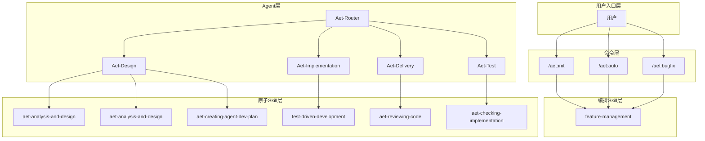
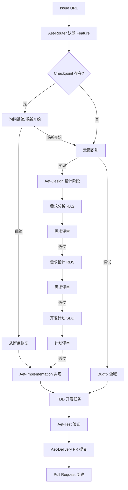
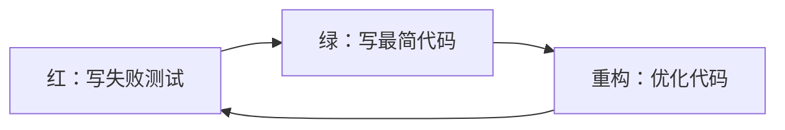

# AET 架构设计

## 概述

AET (Agentic Engineering Team) 是一个智能体驱动的开发框架，通过多个 AI 智能体有序协作，实现结构化软件开发。

### 设计目标

1. **极简协作**：人与 AI 协作，极简完成从需求到实现的完整流程
2. **结构化流程**：通过精心设计的工作流，保证开发质量和可追溯性
3. **断点恢复**：基于 Checkpoint 快照机制，支持任务中断后继续执行
4. **可视化追踪**：通过看板实时查看开发状态和进度

## 设计背景

### 问题背景

1. **开源社区软件类型多样，开发流程各异**：敏捷迭代型项目需要快速交付，传统流程型项目需要严格规范，嵌入式软件需要遵循安全标准。现有 AI 辅助框架缺乏灵活的检查点和交付件模板配置机制，无法根据不同项目特点定义人类决策点、交付件标准，导致 AI 能力难以适配多样化开发场景。
2. **现有 AI 编码工具大多服务于"单兵作战"**：无法理解大型研发团队中架构师、开发、测试、产品等复杂角色的协作边界与工件传递要求，团队沟通协作成本高。
3. **长程任务失败率高成为瓶颈**：引入 AI 辅助开发过程中，长程任务（4-8 小时）失败率高（50%+），长程任务重新执行时需从头执行，重复消耗计算资源，成为 AR 吞吐率提升的主要瓶颈。

### 解决方案

1. **人工检查点与关键交付件模板可配置**：支持用户在流程中可配置人工检查/确认点，关键节点交付件（issue、需求分析文档、需求设计文档）模板可配置。
2. **内置"架构驱动开发（SDD）"与约束**：
   - **设计阶段**：将设计方法（功能树、Dfx 设计等）、架构原则、架构依赖等作为不可篡改的基准上下文，强制 AI 输出需求分析与设计说明书；
   - **开发阶段**：强制 AI 遵循"先测试后实现"逻辑，确保每行代码可验证、有测试依据。
3. **基于阶段产物的协作机制**：将各阶段产出物固化为 Markdown 文件（如架构决策、设计文档、开发计划），直接作为下一阶段的基础上下文，减少团队间协作成本。
4. **任务断点恢复机制**：通过状态快照、恢复与重试机制，使得长程任务中断后可以从断点处恢复执行，减少资源消耗。

## 核心概念

### Agent（智能体）

Agent 是 AET 中专门负责特定开发阶段的 AI 助手：

| Agent                  | 职责                            |
| ---------------------- | ----------------------------- |
| **Aet-Router**         | 核心协调者 - 理解需求、认领 Feature、路由工作流 |
| **Aet-Design**         | 设计智能体 - 需求分析、架构设计、开发计划        |
| **Aet-Implementation** | 实现智能体 - TDD 驱动开发、代码实现         |
| **Aet-Test**   | 验证智能体 - 功能验证、需求追溯             |
| **Aet-Delivery**       | 完成智能体 - PR 质量检查、PR 提交         |

### Skill（技能）

Skill 是 AET 的核心功能单元，分为三个层次：

| 层次           | 说明     | 示例                                        |
| ------------ | ------ | ----------------------------------------- |
| **命令**       | 用户入口   | `/aet:init`, `/aet:auto`, `/aet:bugfix` |
| **编排 Skill** | 协调子流程  | `feature-management`   |
| **原子 Skill** | 执行单一职责 | `aet-analysis-and-design`, `aet-implementing-requirement`, `aet-reviewing-code` |

### Checkpoint（检查点）

Checkpoint 是 AET 的断点恢复机制：

- 保存位置：`.aet/features/{feature-name}/checkout.json`
- 支持在任务中断后从断点继续执行
- 记录当前阶段、子步骤、文档路径等信息

### 围栏（Fence）

围栏是 AET 的模块依赖保护机制：

- **✅ 允许修改**：本次开发可以修改或新增的文件
- **❌ 禁止修改**：不应修改的关键文件
- **🔵 条件修改**：满足特定条件才能修改

## 全局架构



## 核心工作流

### 开发启动：`/aet:auto`

当用户提供 Issue URL 时，`/aet:auto` 自动启动完整开发流程：



### 设计阶段：Aet-Design

Aet-Design 智能体负责需求到设计的转换，生成三份核心文档：

| 文档      | 全称                                  | 说明     |
| ------- | ----------------------------------- | ------ |
| **RAS** | Requirements Analysis Specification | 需求分析规范 |
| **RDS** | Requirements Design Specification   | 需求设计规范 |
| **SDD** | Software Design Document            | 软件设计文档 |

**设计子步骤**：

| 步骤 | 子步骤  | 输出     |
| -- | ---- | ------ |
| 1  | 需求分析 | RAS 文档 |
| 2  | 需求评审 | 通过/不通过 |
| 3  | 需求设计 | RDS 文档 |
| 4  | 需求评审 | 通过/不通过 |
| 5  | 开发计划 | SDD 文档 |
| 6  | 计划评审 | 通过/不通过 |
| 7  | 提交文档 | Git 提交 |

### 实现阶段：Aet-Implementation

Aet-Implementation 智能体基于设计文档执行 TDD 开发：

```
设计文档 → 实现计划 → TDD 循环 → 功能代码
```

**TDD 循环**：



**任务执行**：

1. 读取设计和实现计划
2. 对每个任务：
   - 编写失败的测试
   - 验证测试失败
   - 编写最简代码
   - 验证测试通过
   - 提交代码

### 验证阶段：Aet-Test

Aet-Test 智能体验证实现是否满足需求：

- **功能验证**：所有必需功能是否已实现
- **需求追溯**：每个需求是否映射到实现
- **代码审查**：实现质量、错误处理、安全性
- **测试覆盖**：测试是否充分

### 完成阶段：Aet-Delivery

Aet-Delivery 智能体处理 PR 提交：

1. **质量检查**：运行 `aet-checking-implementation`
2. **用户确认**：询问是否提交 PR
3. **PR 创建**：使用 `feature-management` 创建 Pull Request
4. **后续处理**：报告 PR 链接

## SR-AR 需求分解

AET 采用 SR-AR 方法进行需求分解：

### SR (System Requirement)

系统需求，对应一个主要场景或功能域：

- 数量控制：一般 1-2 个
- 一个 SR 对应一个功能域
- 优先合并，避免过多 SR

### AR (Architecture Requirement)

架构需求，属于某个具体系统元素：

- 一对一原则：一个 AR 属于一个模块
- 数量控制：每个 SR 默认 1-2 个 AR，最多 3 个
- 必须列出能力点

### 分解示例

```
SR-1: 用户认证功能
  ├── AR-1.1: 用户登录（登录模块）
  └── AR-1.2: 用户注册（注册模块）

SR-2: 内容管理
  ├── AR-2.1: 内容创建（内容模块）
  └── AR-2.2: 内容审核（审核模块）
```

## 项目结构

AET 在项目中创建以下目录结构：

```
.
├── .aet/                        # AET 配置和数据目录
│   ├── config.json              # 项目配置
│   ├── features/                # Feature 目录
│   │   └── feature-{name}/
│   │       ├── feature.json      # Feature 元数据
│   │       ├── issue.md          # Issue 内容副本
│   │       ├── checkout.json      # Checkpoint 快照
│   │       ├── design/           # 设计文档
│   │       │   ├── *-ras.md     # 需求分析规范
│   │       │   ├── *-rds.md     # 需求设计规范
│   │       │   └── *-sdd.md     # 软件设计文档
│   │       ├── implementation/   # 实现文档
│   │       │   └── *-plan.md    # 实现计划
│   │       ├── verification/     # 验证报告
│   │       └── tests/            # 测试代码
│   └── project-analysis/         # 项目分析器输出
├── agents/                      # Agent 配置
│   └── {agent-name}/prompts/main.md
├── skills/                      # Skill 定义
│   └── {skill-name}/SKILL.md
├── commands/                    # 命令定义
├── docs/                        # 项目文档
│   └── zh/                      # 中文文档
│       ├── core-features/
│       ├── reference/
│       └── quick-start/
├── scripts/                     # 脚本
├── aet/                         # AET 核心代码
├── visualization/              # 看板仪表盘
└── hooks/                      # Git Hooks
```

## 平台集成

AET 通过 `platform-api.js` 与代码仓平台交互：

| 功能       | 说明              |
| -------- | --------------- |
| Issue 管理 | 创建、更新、认领 Issue  |
| PR 管理    | 创建 Pull Request |
| 阶段上报     | 向看板上报开发阶段       |

**支持的平台**：GitHub、GitLab、Gitee、AtomGit 等

## 设计原则

### 1. 跨平台兼容性

Agent 的 system prompt 存储在 Skill 的 references 中，通过自然语言指导模型使用子 Agent，不受限于特定平台的 Agent 规范。

### 2. 上下文管理

通过多 Agent 协作和文件交互方式，避免单个 Agent 上下文超限。借助平台的自动上下文压缩机制处理长上下文。

### 3. 渐进式披露

Skill 描述简洁明了，从简单开始，需要时再增加复杂度。核心包含 "When to use" 和 "Workflow" 两部分。

### 4. 错误沉淀

平台 API 交互封装为脚本，遇到错误时总结经验并沉淀到脚本中，通过错误信息反馈给模型，减少模型上下文负担。

### 5. 人工确认点

关键节点（设计评审、计划确认、PR 提交）支持人工确认，用户可以配置确认点，确保用户对重要决策有控制权，满足不同用户、不同场景下差异化确认点的诉求。
