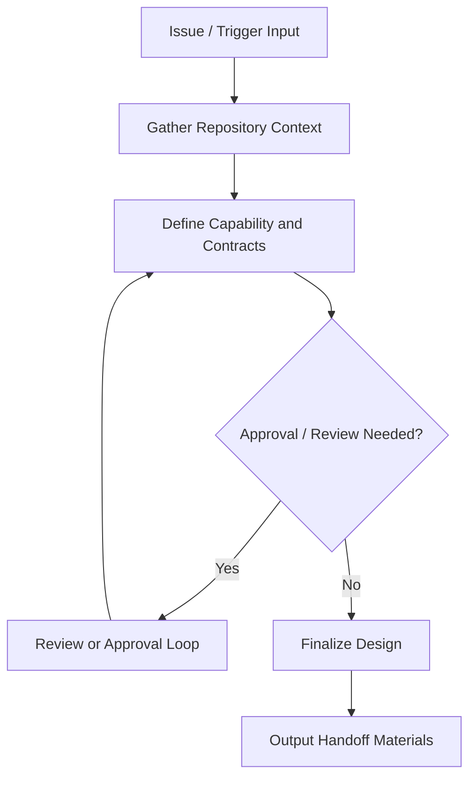

# Agent 需求设计文档模板

<!-- instruction: Keep the document structure unchanged unless the input clearly requires adjustments. Fill placeholders like [ ... ] with concrete project-specific content. Do not output instruction comments in the final document. -->

````markdown
## §1 概要

| 信息 | 内容 |
|------|------|
| **名称** | [Agent / Agent Suite Name] |
| **描述** | [One sentence describing the capability from design perspective] |
| **需求来源** | [AtomGit issue URL / copied issue content / reviewed requirements analysis path] |
| **目标仓库** | [Target repository / local workspace path / AtomGit repo] |
| **领域 / 场景** | [Agent creation / agent extension / agent collaboration / agent routing / agent execution / agent verification] |
| **设计结论** | [New agent / extend existing agent / agent suite extension / agent runtime + prompts + skills + commands + adapters mixed approach] |
| **平台适配暴露** | [Not needed / update existing adapters / add `.opencode/` / `.codex/` / `.claude-plugin/` / equivalent adapters] |

---

## §2 Issue 与仓库基线

### 2.1 Issue 摘要

**问题背景**：[Summarize the issue in business or operational language]

**目标能力**：[What the issue expects the system to do]

**验收重点**：[Acceptance points extracted from the issue]

### 2.2 仓库上下文

| 维度 | 内容 |
|------|------|
| **仓库形态** | [Agent repository / agent suite / mixed repository with an Agent surface] |
| **核心目录** | [Relevant folders discovered from repo] |
| **载体语义与识别方式** | [For example: `agents/*.md` discovered by platform, `commands/*.md` used as command definitions, `skills/*/SKILL.md` loaded as skills, runtime code under `src/`] |
| **Agent 产品面** | [For example: runtime agent definitions + prompts + `skills/` packages + `commands/` entry points + `.opencode/` / `.codex/` / `.claude-plugin/` adapters + install docs + verification artifacts] |
| **平台适配层** | [Existing `.opencode/`, `.codex/`, `.claude-plugin/`, install docs, plugin manifests, bootstrap scripts, or equivalents] |
| **现有相关能力** | [Existing agents / prompts / skills / commands / runtime modules / docs] |
| **上下游关系** | [Who provides input, who consumes output] |
| **上下文置信度** | [High / Medium / Low, with reason] |

### 2.3 已识别假设

```text
- [Assumption based on live repo or AtomGit snippets]
- [Open question if local repo is unavailable]
```

---

## §3 设计结论摘要

### 3.1 背景与目标

**用户价值**：[What value the capability creates for users, operators, or downstream systems]

**成功标准**：[Observable criteria that indicate the design is successful]

### 3.2 设计结论

<!-- instruction: Use 1-2 short paragraphs. Explicitly answer “落在哪些 carrier 上，为什么不是其他方案”。 -->

[Design conclusion summary]

### 3.3 Agent 产品面蓝图（当目标是开发 Agent 套件时必填）

| 交付层 | 是否涉及 | 当前仓库锚点 / 目标形态 | 说明 |
|--------|----------|------------------------|------|
| Agent runtime definitions | [是/否] | [e.g. `agents/*/index.js` / equivalent] | [Why] |
| Agent prompts / references | [是/否] | [e.g. `agents/*/prompts/` / equivalent] | [Why] |
| Reusable skills / guidance packs | [是/否] | [e.g. `skills/*/SKILL.md`] | [Why] |
| Command / trigger surface | [是/否] | [e.g. `commands/*.md` / slash command / CLI entry] | [Why] |
| Runtime modules / orchestration core | [是/否] | [e.g. `src/` / `lib/` / `scripts/`] | [Why] |
| Platform adapters | [是/否] | [e.g. `.opencode/` / `.codex/` / `.claude-plugin/`] | [Why] |
| Install / bootstrap / discovery docs | [是/否] | [README / INSTALL / bootstrap] | [Why] |
| Verification / evidence artifacts | [是/否] | [tests / walkthrough / docs / fixtures] | [Why] |

---

## §4 载体决策与边界

### 4.1 Carrier 决策

| Carrier | 选择结果 | 理由 | 备选方案为何不选 |
|---------|----------|------|------------------|
| `agents/` or equivalent carrier definition | [新增/修改/不涉及] | [Reason] | [Why not alternative] |
| agent prompts / references | [新增/修改/不涉及] | [Reason] | [Why not alternative] |
| `skills/` / agent guidance layer | [新增/修改/不涉及] | [Reason] | [Why not alternative] |
| `src/` / runtime support modules | [新增/修改/不涉及] | [Reason] | [Why not alternative] |
| `commands/` / agent trigger definitions | [新增/修改/不涉及] | [Reason] | [Why not alternative] |
| platform adapters (`.opencode/` / `.codex/` / `.claude-plugin/` / equivalent) | [新增/修改/不涉及] | [Reason] | [Why not alternative] |
| install / bootstrap / discovery docs | [新增/修改/不涉及] | [Reason] | [Why not alternative] |
| agent registration / config | [新增/修改/不涉及] | [Reason] | [Why not alternative] |
| docs / tests / fixtures | [新增/修改/不涉及] | [Reason] | [Why not alternative] |

### 4.2 变更边界

```text
✅ 允许新增：
- [Path or artifact]

🟡 允许修改：
- [Path or artifact and boundary]

⚠️ 禁止修改：
- [Path or artifact and reason]
```

---

## §5 领域模型与能力分解

### 5.1 输入 / 输出契约

| 契约 | 提供方 | 消费方 | 关键字段 / 语义 | 备注 |
|------|--------|--------|-----------------|------|
| Input Contract | [Provider] | [Consumer] | [Fields / semantics] | [Note] |
| Output Contract | [Provider] | [Consumer] | [Fields / semantics] | [Note] |

### 5.2 能力分解

| 能力编号 | 能力名称 | 触发条件 | 处理逻辑 | 输出 | Owner Carrier |
|----------|----------|----------|----------|------|---------------|
| CAP-001 | [Capability name] | [Trigger] | [Processing logic] | [Artifact / message / state change] | [agent definition / prompt asset / skill package / runtime support module / command definition / registration-config / adapter metadata] |

### 5.3 运行模式与控制点

| 控制点 | 是否需要 | 说明 |
|--------|----------|------|
| 人工审批 | [Yes/No] | [When and why] |
| 回滚 / 补偿 | [Yes/No] | [When and why] |
| 审计 / 日志 | [Yes/No] | [What must be recorded] |
| 平台发现 / 加载 / 安装验证 | [Yes/No] | [Which adapter behavior must be observable and why] |
| 幂等 / 去重 | [Yes/No] | [Trigger or execution rule] |

---

## §6 端到端流程与状态机

### 6.1 主流程



### 6.2 状态节点定义

| 状态 | 进入条件 | 输出 | 退出条件 |
|------|----------|------|----------|
| [State name] | [Condition] | [Artifact / side effect] | [Condition] |

### 6.3 审批 / Review / Resume 规则（按需）

| 环节 | 审批 / 评审对象 | 可能反馈 | 系统应如何处理 |
|------|-----------------|----------|----------------|
| [Design review] | [Document / decision / boundary] | [Correction / addition / approval / rejection] | [Behavior] |

### 6.4 Recovery / Retry / Idempotency 规则（按需）

| 场景 | 恢复点 | 系统动作 | 备注 |
|------|--------|----------|------|
| [Interrupted execution or design] | [Artifact / state] | [Resume behavior] | [Note] |
| [Repeated trigger / duplicate event] | [Existing state] | [Idempotent behavior] | [Note] |

---

## §7 安全策略、审计与可观测性

| 关注点 | 方案决策 | 触发条件 | 验证方式 |
|--------|----------|----------|----------|
| 风险分级 / 审批 | [Decision] | [Condition] | [Verification] |
| 回滚 / 补偿 | [Decision] | [Condition] | [Verification] |
| 日志 / 审计 | [Decision] | [Condition] | [Verification] |
| 指标 / 报告 / 证据 | [Decision] | [Condition] | [Verification] |

---

## §8 仓库产物变更计划

| 产物 | 所属产品面 | 动作 | 格式 / 被谁识别 | 原因 | 备注 |
|------|------------|------|----------------|------|------|
| `[Artifact family or proven anchor path]` | [agent runtime / prompt / skill / command / runtime module / adapter / install-doc / verification] | [新增/修改/不涉及] | [Markdown / SKILL.md / YAML / JSON / JS / Python / other, and the consuming platform/runtime] | [Reason] | [Note / confidence if provisional; avoid speculative implementation scaffolding at this stage] |

---

## §9 集成点与契约

### 9.1 上游输入契约

| 输入 | 来源 | 处理方 | 说明 |
|------|------|--------|------|
| [Input] | [upstream agent / command / platform adapter / user] | [Consumer] | [Note] |

### 9.2 内部 Agent 运行时契约

| 提供方 | 消费方 | 契约内容 | 兼容性说明 |
|--------|--------|----------|------------|
| [Provider] | [Consumer] | [Contract] | [Compatibility note] |

### 9.3 平台适配 / 共享运行时集成

| 共享能力 | 集成方式 | 前置条件 | 失败处理 |
|----------|----------|----------|----------|
| [adapter / shared runtime / registration loader / external dependency] | [How it is used] | [Precondition] | [Failure handling] |

---

## §10 验证与验收场景

| 场景编号 | 场景名称 | 类型 | 前置条件 | 关键步骤 | 期望结果 |
|----------|----------|------|----------|----------|----------|
| AC-001 | [Happy path] | 正常 | [Condition] | [Steps] | [Expected result] |
| AC-002 | [Error or rollback path] | 异常 | [Condition] | [Steps] | [Expected result] |
| AC-003 | [Approval / review / recovery path] | 控制路径 | [Condition] | [Steps] | [Expected result] |
| AC-004 | [Failure path] | 异常 | [Condition] | [Steps] | [Expected result] |

---

## §11 非目标、开放问题与交接说明

### 11.1 非目标

```text
- [Explicitly out-of-scope item]
- [Deferred item]
```

### 11.2 开放问题

| 问题 | 影响 | 后续处理建议 |
|------|------|--------------|
| [Question] | [Impact] | [Suggestion] |

### 11.3 交接说明

```text
- [Notes for downstream planning / implementation]
- [Any provisional file targeting or unresolved assumptions]
```
````
